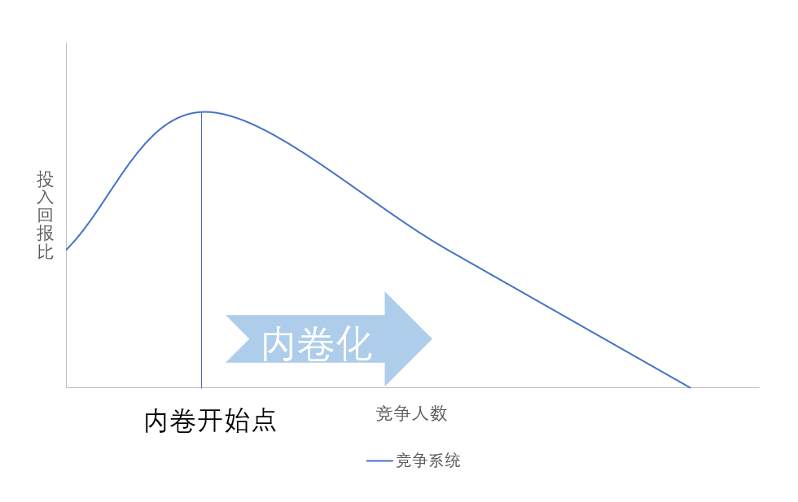
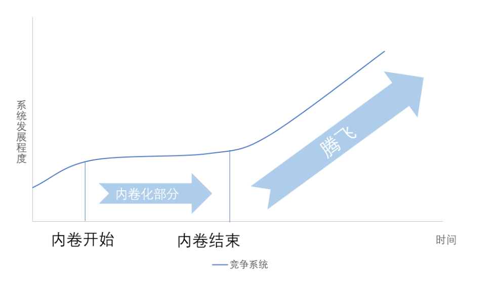

## “内卷”一词的发展历史
“内卷”来自于“内卷化”，“内卷化”一词的英文为involution。它始于康德、戈登威泽(AlexanderGoldenweiser),由格尔茨(CliffordGeertz)成型,经黄宗智加以改造后更加引发了争论，郭继强后来对“内卷化”一词重新进行了辨析，提出了新的理解。

我们这里引用《长三角州小农》中的一段话，它介绍了长三角州小农总体经济增产与家庭和个人的关系：“就总产出和总产值的绝对量而言,明清时期长江三角洲的农村经济的确出现了相当幅度的增长;以整个家庭的年收入来分析,农村经济也显示了若干程度的增长。但是仔细考察一下就会发现,这种增长乃是以单位工作日的报酬递减为代价而实现的。家庭年收入的增长,不是来自单位工作日报酬的增加,而是来自家庭劳动力更充分的利用,诸如妇女、儿童、老年劳动力,以及成年男子闲暇时间的劳动力。这就是“无发展的增长”、或者说“内卷型增长”“

## 内卷的定义
我们使用这个观点，给出“内卷“的一个简单现代定义：当我们说“某个系统开始内卷了“，意思是这个系统的发展变成了一种恶性竞争，当我们说“某个人开始内卷了”，意思就是指某个人开始参与一种恶性竞争，这恶性竞争的特点是：
1. 竞争中充斥这每个竞争者大量低质的投入；
2. 每增加一个竞争者，竞争的投入回报比将大幅下降；
3. 高质的投入收益甚微；
4. 恶性竞争会使系统的发展速度逐渐变缓；
5. 当发展速度极低时，整个系统会去寻找解决办法终止恶性竞争，让发展重新提速。
 
 
图一中的“投入“特指低质高量的投入。
 
 
接下来，我们把以上的定义和两张图应用到实际中。

## 使用例 论文字数的内卷
我们首先来确定内卷及其竞争系统的各个组成部分：
1.	竞争系统：同时学生对高绩点有着强烈的追求；
2.	投入回报比：每100字可以让一个学术获得的分数；
3.	系统发展程度：全体学生的学术能力的发展程度。

我们确定好各个组成部分后，来看内卷化和腾飞两个发展进程：
1.	内卷化：越来越多的学生追求越来越多的字数；
2.	腾飞：学生们对高质量字数的追求停止，大家都开始优质完成任务。

将以上内容结合，简单来讲“论文字数的内卷”就是：

有一门课让交5000字论文，有意义的竞争应该是力求在5000字左右做出最好的文章，但有的学生认为大家都是5000字，他写10000字肯定老师要给他多几分，想法走漏出去，大家纷纷开始盲目增加字数，结果全班个个都写了数万字水文，只有大家水字数的能力得到了提升；后来老师开始限定字数上限并用质量评分，同学们也开始按质完成论文，大家的学术能力都得到了明显提升。
在论文字数的内卷中内卷化的结束，也许是因为有同学向老师提出了按质评分的标准，也许是因为老师自己发现情况不对，也许是因为上面的指示。

## 结语
我很庆幸自己现在处在一个非内卷化的大系统中，可以做各种自己喜欢的事情。我期盼着世界上其他的系统都能早日结束内卷，进入到正向循环中。置于到底什么可以让内卷结束？什么可以让系统从内卷化转变成腾飞？这就是每个系统需要考虑的问题了。我这样系统外的人能做的也就只是发发文章，谈谈见解了。

## 参考与拓展阅读
* 刘世定,邱泽奇.“内卷化”概念辨析.社会学研究,2004
* 郭继强.“内卷化”概念新理解.社会学研究,2007
* 内卷化：我国高等教育的隐忧，李书肖，2010
* 《长江三角洲小农经济与乡村发展》, 黄宗智等译校
* _Geertz, Clifford 1963 , Agricultural Involution:The Process of Ecological Change in Indonesia.Berkeley and Los Angeles:University of California Press._
* 《与恶龙斗，其乐无穷》，知乎专栏，作者：迟先生
* 《软件工程专业困局（写在高考之前）》，知乎专栏，作者：tison

## 协力制作
小组的各位：小王，小冯，小刁